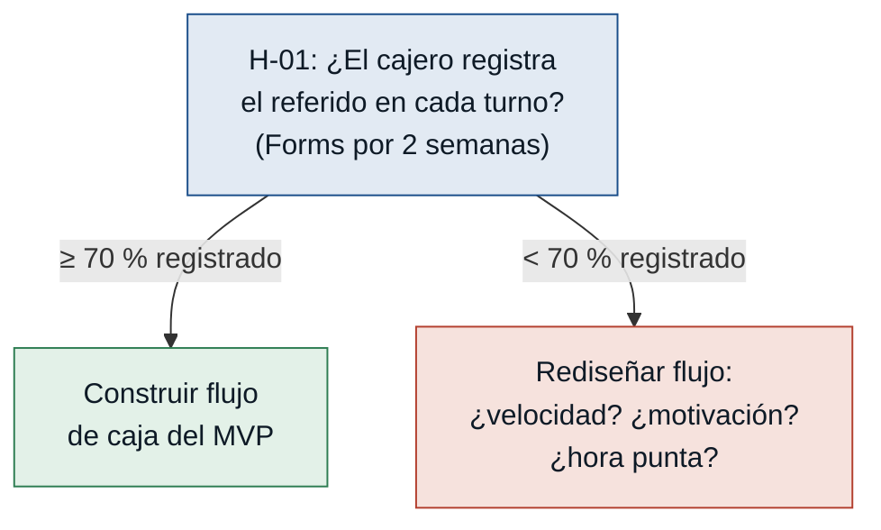
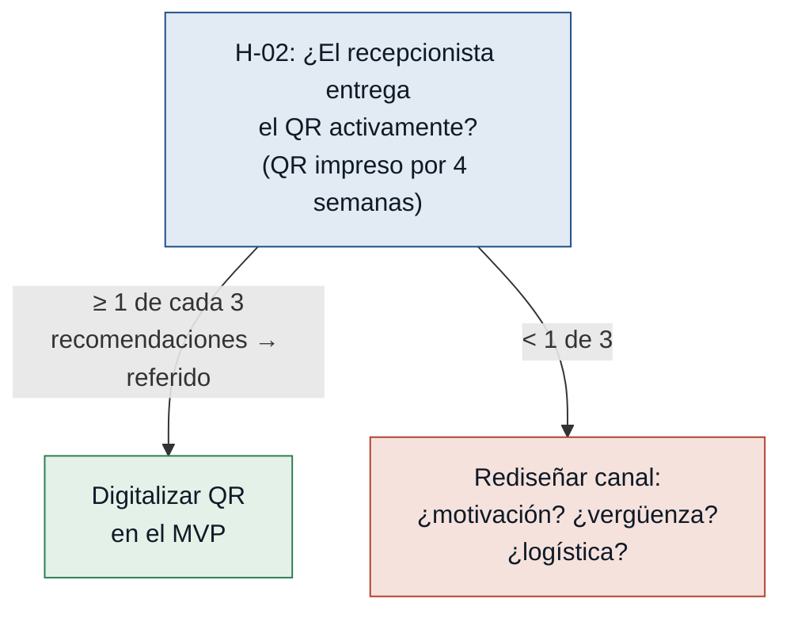
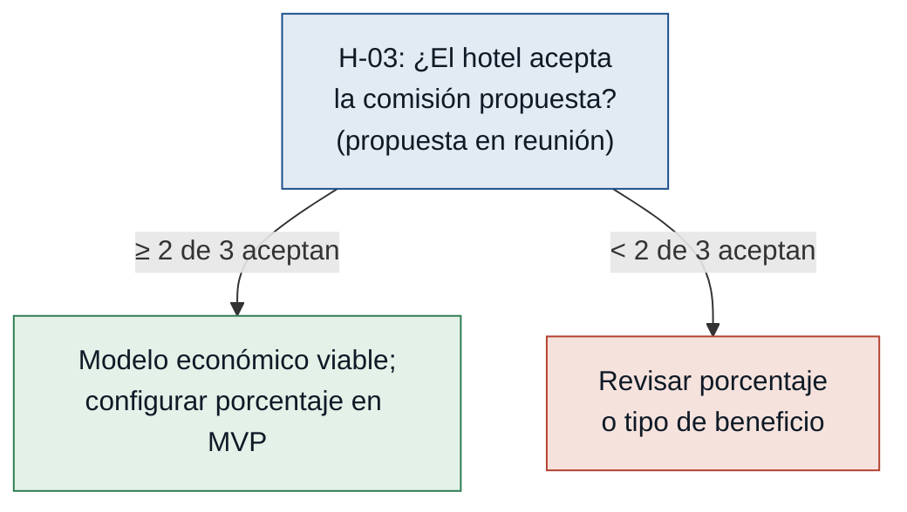
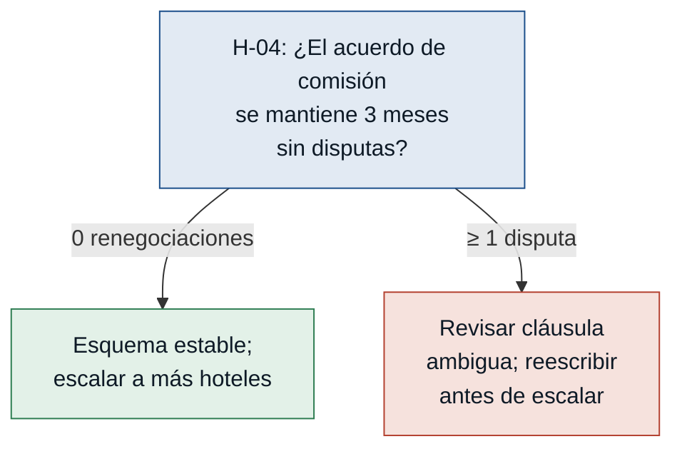

# Hipótesis y experimentos — Sistema de referidos hoteles-restaurante

Ordenadas de mayor a menor riesgo para el MVP. Probar en este orden: si H-01 o
H-02 fallan, no tiene sentido invertir en el sistema completo.

---

### [H-01] Adopción operativa del cajero — riesgo: alto

- **Supuesto a probar:** El cajero / personal operativo registrará el referido en
  el sistema incluso en horas de alta demanda, sin omitir el paso.
- **Hipótesis:** Creemos que el cajero registrará el hotel de origen en ≥ 70 %
  de las cuentas de clientes referidos si el flujo de registro no supera
  30 segundos y no requiere abrir otra aplicación, porque la fricción operativa
  es el único motivo declarado por el que se omite el registro hoy.
- **Señal medible:** Porcentaje de cuentas de clientes referidos con código de
  hotel registrado correctamente antes del cierre, sobre el total de clientes
  que mencionaron venir de un hotel en el turno.
- **Criterio de éxito:** ≥ 70 % de cuentas referidas con código registrado en
  las primeras 2 semanas de piloto con al menos 1 cajero en turno real.
- **Experimento:** Mago de Oz / Concierge — se entrega al cajero un formulario
  Google Forms con tres campos (hotel, número de mesa o cuenta, valor consumido).
  El cajero lo llena al momento del cobro durante 2 semanas. No se construye
  ningún sistema. Se mide la tasa de llenado y los motivos de omisión al final
  de cada turno.
- **Caja de tiempo / costo:** 2 semanas de operación real + 2 conversaciones de
  5 minutos de cierre por día. Costo: cero (Google Forms es gratuito).
- **Regla de decisión:** Si pasa (≥ 70 %): el cajero puede adoptar el paso
  operativo; construir el flujo de caja del MVP. Si falla (< 70 %): investigar
  si el bloqueo es velocidad, motivación o contexto de alta demanda; rediseñar
  el flujo antes de construir cualquier cosa.

---

### [H-02] Motivación del canal hotel — riesgo: alto

- **Supuesto a probar:** El recepcionista de hotel entregará el código o QR al
  huésped de forma activa y consistente en cada recomendación, sin necesitar
  recordatorios constantes.
- **Hipótesis:** Creemos que al menos 1 de cada 3 recomendaciones del hotel
  terminará en un referido registrado en el restaurante si el mecanismo de
  referido es un QR impreso que el recepcionista puede entregar sin ningún paso
  digital, porque la principal barrera declarada es la fricción operativa, no
  la falta de intención.
- **Señal medible:** Número de referidos registrados en el restaurante dividido
  por el número de recomendaciones emitidas por el hotel en el mismo período
  de 4 semanas.
- **Criterio de éxito:** Al menos 1 de cada 3 recomendaciones del hotel genera
  un referido registrado en el restaurante en las primeras 4 semanas del piloto.
- **Experimento:** Fake door con QR impreso — imprimir el QR identificador del
  hotel en papel (sin sistema digital) y entregárselo físicamente al
  recepcionista. Pedir al recepcionista que lo ofrezca a huéspedes que pregunten
  por restaurantes. Medir cuántos huéspedes llegan al restaurante mostrando el
  papel en las 4 semanas siguientes.
- **Caja de tiempo / costo:** 4 semanas de observación + 1 conversación de
  seguimiento semanal con el recepcionista. Costo: impresión de 1 hoja + tiempo
  de 2 conversaciones de cierre.
- **Regla de decisión:** Si pasa (≥ 1 de cada 3 recomendaciones genera referido
  registrado): el canal hotel funciona con mínima fricción; proceder a digitalizar
  el QR en el MVP. Si falla (< 1 de 3): entrevistar al recepcionista para
  distinguir si el problema es motivación insuficiente, vergüenza operativa
  o logística; ajustar el diseño del canal antes de construir.

---

### [H-03] Valor económico percibido por el hotel — riesgo: medio

- **Supuesto a probar:** El porcentaje de comisión propuesto (entre 5 % y 10 %
  sobre consumo referido) es suficiente para que los hoteles consideren el
  esfuerzo de participar justificado.
- **Hipótesis:** Creemos que ≥ 2 de los primeros 3 hoteles contactados aceptarán
  un acuerdo de participación con comisión de entre 5 % y 10 % si la propuesta
  incluye un reporte visible de beneficios acumulados, porque la incertidumbre
  sobre si la comisión llegará (falta de trazabilidad) es la principal objeción
  declarada, más que el porcentaje en sí.
- **Señal medible:** Número de hoteles que aceptan verbalmente o por escrito
  participar en el piloto con el porcentaje propuesto, sobre el total de hoteles
  contactados.
- **Criterio de éxito:** ≥ 2 de los primeros 3 hoteles contactados aceptan
  participar en el piloto en las primeras 3 semanas de negociación.
- **Experimento:** Entrevista dirigida con propuesta concreta — presentar a
  3 hoteles una propuesta de 1 página con porcentaje de comisión específico,
  regla de cálculo (sobre total consumido por cliente referido) y un mock de
  reporte de beneficios. Registrar si aceptan, rechazan o piden cambiar el
  porcentaje.
- **Caja de tiempo / costo:** 3 semanas de negociación + 3 reuniones de
  30 minutos + 1 hoja impresa por hotel. Costo: 3 horas de tiempo.
- **Regla de decisión:** Si pasa (≥ 2 de 3 aceptan): el modelo económico es
  viable para el piloto; usar el porcentaje aceptado como base de configuración.
  Si falla (< 2 de 3 aceptan): revisar si el rechazo es por porcentaje bajo,
  base de cálculo distinta o desconfianza en el registro; ajustar la oferta
  antes de contactar más hoteles.

---

### [H-04] Estabilidad del acuerdo de comisión — riesgo: bajo

- **Supuesto a probar:** El porcentaje de comisión acordado puede mantenerse
  estable durante los primeros 3 meses del piloto sin renegociaciones, permitiendo
  operar el MVP sin cambios de configuración frecuentes.
- **Hipótesis:** Creemos que el administrador del restaurante y los hoteles
  aliados mantendrán el acuerdo sin renegociación durante los primeros 3 meses
  si el acuerdo inicial se documenta por escrito con porcentaje, base de cálculo
  y período de revisión programado, porque la principal fuente de conflicto
  declarada es la ambigüedad del acuerdo original, no el porcentaje en sí.
- **Señal medible:** Número de renegociaciones o disputas sobre el porcentaje o
  base de cálculo de la comisión registradas en los primeros 3 meses del piloto.
- **Criterio de éxito:** 0 renegociaciones no planificadas sobre comisiones en
  los primeros 3 meses del piloto.
- **Experimento:** Acuerdo escrito simple — redactar un documento de 1 página
  con el hotel piloto que especifique: porcentaje de comisión, base de cálculo,
  período de revisión (al tercer mes) y mecanismo de reporte. Acordar y confirmar
  por escrito. Medir si hay disputas en 3 meses.
- **Caja de tiempo / costo:** 1 hora de redacción + 1 reunión de firma + 3 meses
  de observación pasiva. Costo: prácticamente cero.
- **Regla de decisión:** Si pasa (0 disputas en 3 meses): el modelo comercial es
  suficientemente estable; mantener el esquema para hoteles adicionales. Si falla
  (≥ 1 disputa no planificada): identificar qué cláusula del acuerdo generó la
  ambigüedad; reescribirla antes de incorporar más hoteles.

