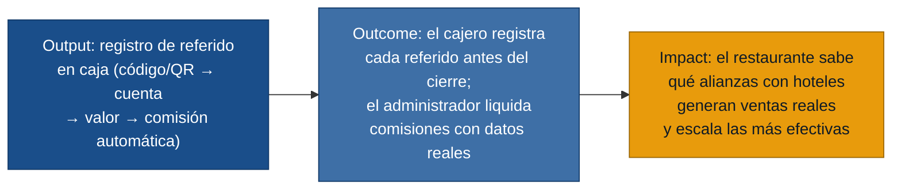

# MVP Canvas — Sistema de referidos hoteles-restaurante

## Cadena de valor

---

## Canvas

| Bloque | Contenido |
|---|---|
| **Propuesta de valor** | Cerrar el ciclo de referidos: desde que el recepcionista entrega un código al huésped hasta que el administrador liquida la comisión con registro trazable, eliminando la dependencia de la memoria del personal. |
| **Segmento de usuarios** | Cajero / personal operativo del restaurante (usuario principal de caja); administrador del restaurante (usuario de reportes y configuración); recepcionista de hotel (usuario del canal de referido). |
| **Funcionalidades mínimas** | 1. Configuración de hoteles aliados con código único y porcentaje de comisión. ➜ 2. Registro de referido en caja: selección de hotel de una lista, asociación a la cuenta y valor consumido, en < 30 s. ➜ 3. Confirmación visual inmediata del registro. ➜ 4. Reporte diario para el cajero (lista de referidos del día). ➜ 5. Reporte mensual para el administrador (referidos, ventas, ticket promedio, comisión, estado de actividad por hotel). ➜ 6. QR o código imprimible por hotel, sin login del recepcionista. |
| **Resultado esperado (outcome)** | El cajero registra el hotel en ≥ 70 % de las cuentas de clientes referidos antes del cierre de caja. El administrador puede liquidar comisiones con datos del sistema, sin reconstruir de memoria. |
| **Métrica de éxito** | Porcentaje de cuentas de clientes referidos con código de hotel registrado correctamente al cierre, medido en las primeras 4 semanas de uso. Línea base: 0 % (hoy todo es verbal). Meta: ≥ 70 %. Prueba ácida: si supera el 70 %, el administrador puede pasar la liquidación mensual sin llamadas de reclamo. |
| **Riesgos / supuestos** | • El cajero usará el sistema incluso en horas de alta demanda (supuesto de adopción operativa). • Los recepcionistas de hotel entregarán activamente el código/QR sin que se los recuerden cada vez (supuesto de motivación del canal). • Los hoteles considerarán la comisión suficiente para mantener el acuerdo (supuesto de valor económico). • El porcentaje de comisión puede acordarse y mantenerse estable en el MVP (supuesto de simplicidad comercial). |
| **Fuera de alcance (por ahora)** | Pagos automáticos de comisiones desde el sistema. App móvil propia. Integración con sistemas contables o POS existentes. Funciones de marketing, fidelización o descuentos. Creación de cuentas de usuario por empleado. Gestión multirestaurante. |

---

## Dolores que resuelve el MVP (por persona)

| Persona | Dolor principal atacado | Fuente |
|---|---|---|
| Cajero / Operativo | `olvido-registro-referido`, `errores-registro-manual` | `cajero-restaurante.md` |
| Administrador | `falta-trazabilidad-referidos`, `calculo-comisiones-impreciso` | `administrador-restaurante.md` |
| Recepcionista hotel | `recomendaciones-sin-seguimiento`, `comision-poco-clara` | `recepcionista-hotel.md` |

---

## Supuestos riesgosos (insumo para /discovery:experiments)

Los cuatro supuestos marcados como riesgos en el Canvas, en orden descendente
de riesgo para el MVP:

1. **Adopción operativa en caja** — el cajero registra el referido aunque el
   restaurante esté lleno. Es el punto más frágil: si falla, no hay datos.
2. **Motivación del canal hotel** — el recepcionista entrega el código/QR de
   forma activa y consistente. Sin esto, no entran referidos al sistema.
3. **Valor económico para el hotel** — la comisión o beneficio acordado es
   suficiente para que el hotel considere el esfuerzo justificado.
4. **Estabilidad del acuerdo de comisión** — el porcentaje puede definirse y
   respetarse sin renegociaciones frecuentes en la etapa piloto.
