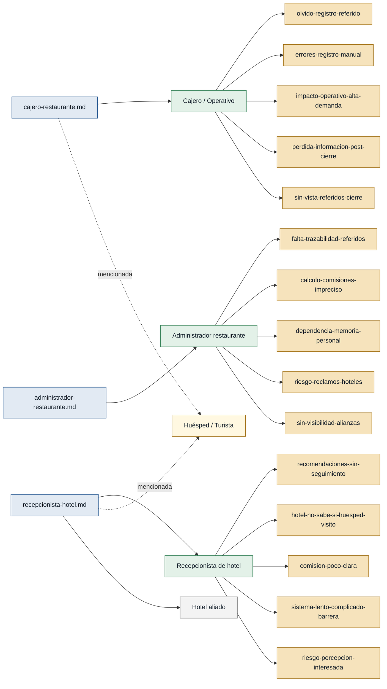

# Personas — Sistema de referidos hoteles-restaurante

---

## Personas

### Cajero / Personal operativo — cajero_restaurante

- **Contexto:** Trabaja en la operación diaria del restaurante; registra consumos,
  atiende clientes y cierra cuentas en caja.
- **Objetivo principal:** Registrar el referido del hotel sin afectar la velocidad
  de atención al cliente.
- **Dolores:**
  - Olvida preguntar o registrar el referido cuando hay alta demanda.
    (`cajero-restaurante.md`)
  - Registrar nombres de hoteles manualmente genera errores de escritura o
    duplicados. (`cajero-restaurante.md`)
  - Si no se registra en el momento del cobro, la información se pierde al cierre.
    (`cajero-restaurante.md`)
  - Al cerrar el día no existe una vista consolidada de referidos por hotel.
    (`cajero-restaurante.md`)
  - Cualquier paso adicional en horas de alta demanda afecta la operación.
    (`cajero-restaurante.md`)
- **Respaldo:** `primera mano` — `cajero-restaurante.md`

---

### Recepcionista de hotel — recepcionista_hotel

- **Contexto:** Atiende huéspedes en un hotel en San Cristóbal, Galápagos;
  recomienda restaurantes y servicios locales cuando los huéspedes lo preguntan.
- **Objetivo principal:** Dar una recomendación confiable al huésped con el
  mínimo esfuerzo operativo posible.
- **Dolores:**
  - Las recomendaciones actuales son verbales y no tienen seguimiento; no sabe
    si el huésped fue ni cuánto consumió. (`recepcionista-hotel.md`)
  - Sin registro, no hay forma de saber si corresponde o no una comisión para
    el hotel. (`recepcionista-hotel.md`)
  - El personal no usaría un sistema lento o que requiera datos personales del
    huésped. (`recepcionista-hotel.md`)
  - Si el huésped percibe la recomendación como interesada (por comisión) en
    lugar de genuina, afecta la imagen del hotel. (`recepcionista-hotel.md`)
- **Respaldo:** `primera mano` — `recepcionista-hotel.md`

---

### Administrador del restaurante — administrador_restaurante

- **Contexto:** Gestiona la administración de un restaurante en San Cristóbal,
  Galápagos; supervisa alianzas comerciales con hoteles y controla resultados.
- **Objetivo principal:** Conocer cuántos clientes llegan por cada hotel, cuánto
  consumen y qué comisión corresponde pagar, con respaldo trazable.
- **Dolores:**
  - No hay trazabilidad sobre qué hotel envió a qué cliente; todo depende de
    que el cliente lo mencione espontáneamente. (`administrador-restaurante.md`)
  - El cálculo de comisiones se hace de forma manual e imprecisa, dependiendo
    de registros que pueden estar incompletos. (`administrador-restaurante.md`)
  - El proceso depende de la memoria del personal, lo que genera pérdidas de
    información. (`administrador-restaurante.md`)
  - Sin registro confiable, los hoteles pueden reclamar que enviaron más
    clientes de los que el restaurante tiene registrados. (`administrador-restaurante.md`)
  - No existe visibilidad de qué alianzas con hoteles realmente generan ventas
    y cuáles no están activas. (`administrador-restaurante.md`)
- **Respaldo:** `primera mano` — `administrador-restaurante.md`

---

### Huésped / Turista — huesped

- **Contexto:** Se hospeda en un hotel en Galápagos y es el destinatario de las
  recomendaciones de restaurantes del recepcionista.
- **Objetivo principal:** Recibir una recomendación confiable sin fricción ni
  sensación de presión comercial.
- **Dolores:**
  - Incomodidad si se le solicitan datos personales (cédula, pasaporte, correo)
    para validar el referido. (`recepcionista-hotel.md`, `cajero-restaurante.md`)
  - Percepción negativa si la recomendación parece motivada por comisión y no
    por calidad real. (`recepcionista-hotel.md`)
- **Respaldo:** `referenciada` — mencionada en `recepcionista-hotel.md` y
  `cajero-restaurante.md`; **no existe entrevista de primera mano de este rol**.

---

## Stakeholders

### Hotel aliado (como institución)

- **Interés en el sistema:** Recibir un beneficio medible (comisión o acuerdo
  formal) por los huéspedes que dirige al restaurante, y mantener su imagen como
  recomendador confiable y no interesado.
- **Fuente:** `recepcionista-hotel.md`

---

## Mapa de trazabilidad

